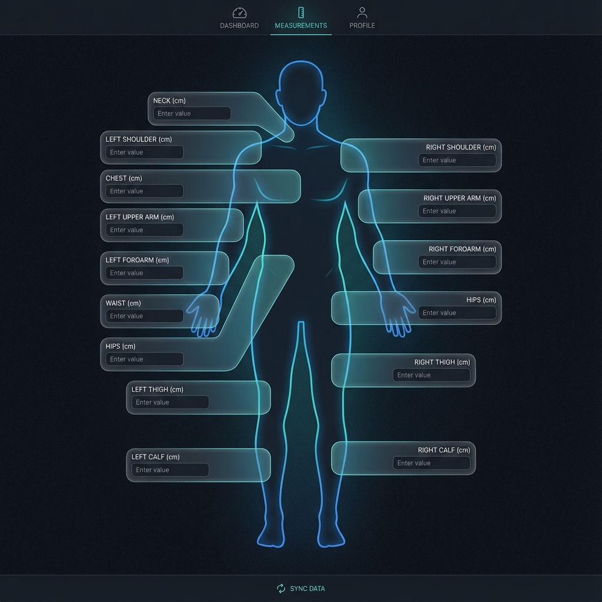

# Body Dimensions Stack (MongoDB + Koa + SolidJS)

## Executive Summary

This repository implements a **private, single-user body measurement tracking system**. It is designed to run as a self-contained stack in a homelab environment.

The system allows you to:
- Track core metrics: **Height**, **Body Weight**, and **Body Fat %**.
- Log detailed **Skinfold Measurements** (mm) across multiple sites.
- Support **high-frequency logging** (multiple entries per day) with **partial data** (e.g., logging only weight in the morning).
- View progress via historical lists, trend overviews, and **range-based area charts** that show intra-day variance.
- Maintain full ownership of your data in a local MongoDB database.

The system is intentionally:
- **Single-user**: No complex authentication or multi-tenancy.
- **Self-hosted**: Entirely containerized via Docker Compose.
- **Private**: Network isolation is the security boundary.

---

## High-Level Architecture

```
[ Web Browser ]
      |
      | HTTP / JSON
      v
[ Node.js API (Koa) ]
      |
      | Document Store (Mongoose / MongoDB)
      v
[ MongoDB Database ]
```

### Network Scope
- Everything runs **inside a private LAN or VPN**.
- The **Web UI** and **API** are accessible on their respective ports.
- The **Database** is internal to the Docker network.
- **No authentication** is implemented at the application layer; access is controlled via network security.

---

## Core Components

### 1. Web Frontend (SolidJS + Vite)
- **Role**: Premium user interface for data entry and visualization.
- **Features**:
  - **Visual Entry Form**: Intuitive, spatial data entry using an interactive anatomical body diagram. Inputs for circumferences and skinfolds are positioned directly over the corresponding body parts for rapid, context-aware logging.
  - **History**: Sortable table of all past measurements.
  - **Reports & Viz**: Advanced charts using **Range/Area bands** for metrics like weight. Instead of a single line, use areas to represent daily highs, lows, and averages to visualize intra-day fluctuations (e.g., morning vs. evening weight).
  - **Trends**: Visual indicators of changes over 7 and 30 days, calculated from aggregated daily baselines.

### 2. Node.js API (Koa + TypeScript)
- **Role**: Handles business logic and serves as the gateway to the database.
- **Responsibilities**:
  - Validates incoming measurement data using **Zod**.
  - Provides trend calculations (deltas) for the frontend.
  - Manages CRUD operations for entries and nested skinfold records.
  - Centralized error handling and standardized JSON responses.

### 3. Database (MongoDB)
- **Role**: Flexible document storage.
- **Schema**:
  - `Entries`: A single collection where each document contains all measurements (core, skinfolds, and circumferences) for a specific point in time.

---

## Product Scope

### Core Measurements
- **Height** (cm)
- **Body Weight** (kg)
- **Body Fat %** (percent)
- **Skinfolds** (mm) — Multiple sites (e.g., Abdomen, Thigh, Chest, Suprailiac)
- **Circumferences** (cm) — Multiple sites (e.g., Neck, Shoulders, Chest, Upper Arm, Forearm, Waist, Hips, Thigh, Calf)

### Key User Flows
- **Log Entry**: Add a new snapshot with any subset of fields (e.g., just weight, or just a specific limb circumference).
- **Trend Snapshot**: See "Latest stats" with automatic deltas (e.g., -0.8kg in 7 days).
- **Intra-day Analysis**: Review variance in data captured throughout a single day (e.g., weight swings).
- **Daily/Weekly Reports**: Review detailed progress reports segmented by day and week, using aggregation to smooth out anomalies.
- **Review History**: Scroll through past entries to see progress.
- **Manage Data**: Edit or delete incorrect entries.

---

## API Contract

### Measurements
- `GET /entries?from=...&to=...&limit=...` - List historical entries.
- `GET /entries/latest` - Returns the most recent entry + calculated trends.
- `GET /reports/trends?period=daily|weekly&type=range` - Returns aggregated data including `min`, `max`, and `avg` for the period to support area charts.
- `POST /entries` - Create a new entry (supports partial payloads).
- `PATCH /entries/:id` - Update existing entry data.
- `DELETE /entries/:id` - Remove an entry.

### Request Shape (Example `POST /entries`)
```json
{
  "measuredAt": "2026-01-02T08:00:00.000Z",
  "heightCm": 190.5,
  "weightKg": 108.0,
  "bodyFatPercent": 16.3,
  "skinfolds": [
    { "site": "abdomen", "mm": 29 },
    { "site": "thigh", "mm": 25 }
  ],
  "circumferences": [
    { "site": "neck", "cm": 42.5 },
    { "site": "chest", "cm": 115.0 },
    { "site": "upper_arm_left", "cm": 40.0 }
  ],
  "notes": "Fasted AM"
}
```

---

## Data Model (MongoDB Schema)

### `Entries` collection
```json
{
  "_id": "ObjectId",
  "measuredAt": "ISODate",
  "heightCm": "Number",
  "weightKg": "Number",
  "bodyFatPercent": "Number",
  "skinfolds": [
    { "site": "String", "mm": "Number" }
  ],
  "circumferences": [
    { "site": "String", "cm": "Number" }
  ],
  "notes": "String",
  "createdAt": "ISODate",
  "updatedAt": "ISODate"
}
```

---

## Visual Design Reference

The data entry flow uses a spatial mapping system. Instead of long lists of labels, the UI features an anatomical silhouette where input fields are anchored to specific muscle groups and measurement sites.



---

## Configuration Model

All configuration is environment-variable driven.

### API
- `DATABASE_URL`: Connection string for MongoDB (e.g., `mongodb://db:27107/body-dimensions`).
- `PORT`: API binding port (default 3000).
- `CORS_ORIGIN`: Allowed frontend origin.

### Web
- `VITE_API_URL`: Backend API endpoint.

---

## Deployment Model (Docker Compose)

The entire stack is managed as a single unit via Docker Compose.

### Quick Start
```bash
docker compose up -d --build
```

### Included Services
- `api`: Node.js backend.
- `web`: SolidJS frontend (served via Nginx).
- `db`: MongoDB 7.0 instance.

---

## Design Philosophy

This project optimizes for **Data Autonomy** and **Simplicity**.

- **No Placeholders**: Every feature in the scope is intended for real use.
- **Data Granularity**: Designed for "entry-first" logging. Whether you log 10 times a day or once a week, the system handles partial data gracefully.
- **Visualization First**: Charts aren't just lines; they are designed to show the "truth" of the data, including variance and range, to help distinguish between actual progress and daily fluctuations.
- **Single Command**: One `docker compose up` should result in a fully functional, production-ready private service.

---

## Future Evolution (Post-MVP)
- **Calculated BF%**: Automated formulas based on skinfold entries.
- **Data Portability**: Export/Import via CSV.
- **Visuals**: Charts for weight and body fat trends.
- **Photos**: Progress picture attachments per entry.
